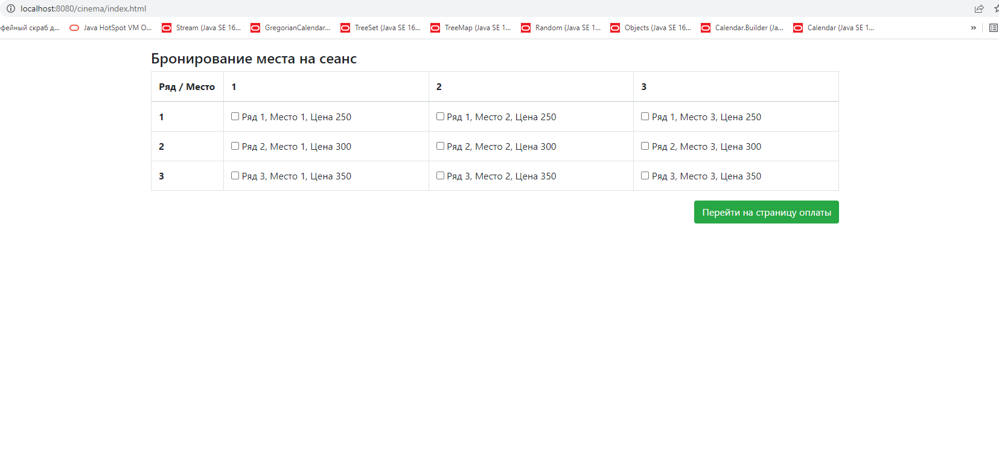
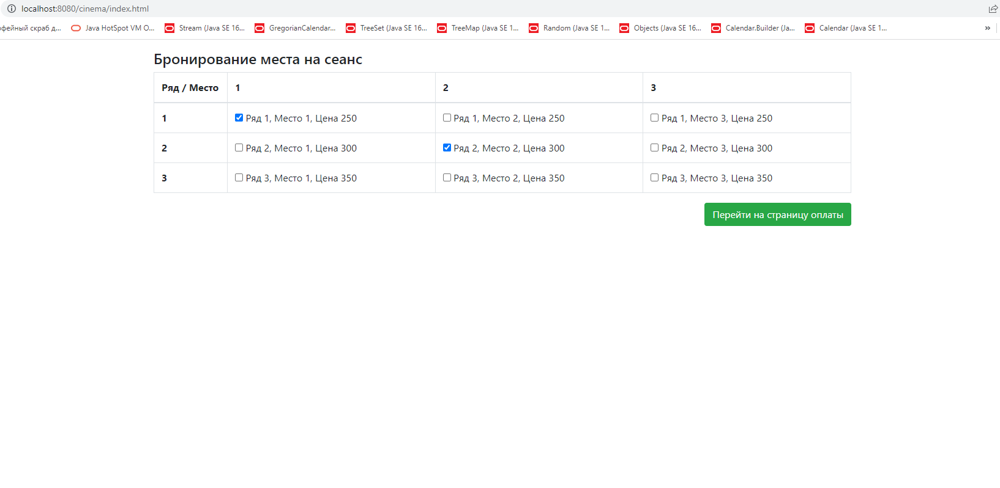
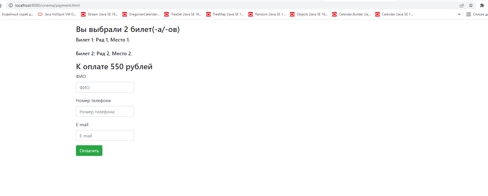
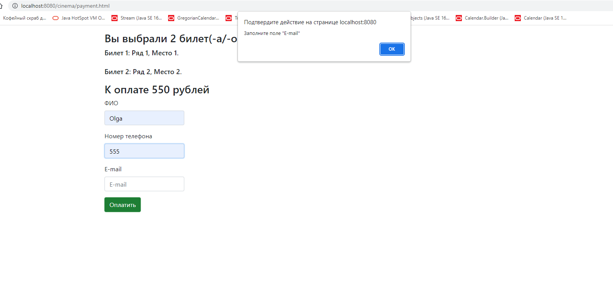
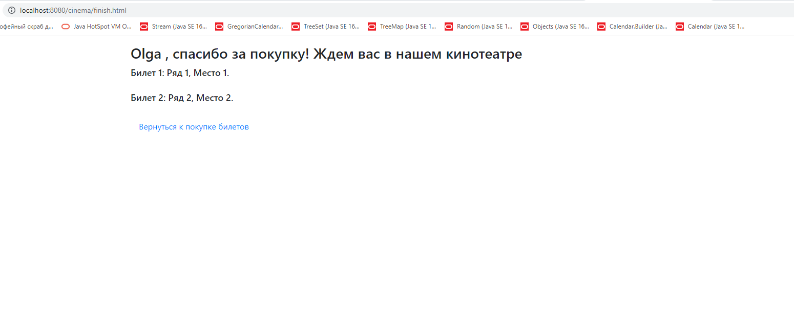
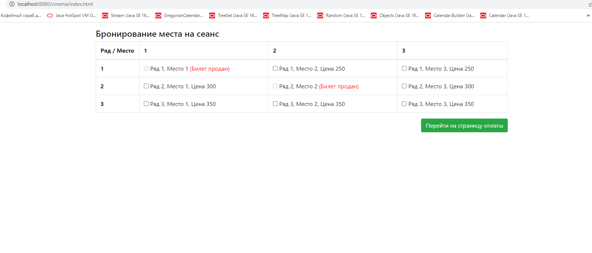

В проекте "Кинотеатр" представлен сервис покупки билетов в кино.
Главная страница:

Мы можем выбрать 1 билет или несколько.
Для получения актуальной информации о наличии билетов происходит обновление таблицы каждые 5 секунд.
После обновления таблицы выбранные ранее билеты остаются выделенными.

Далее мы можем перейти на страницу оплаты билетов. Здесь отображается сводная информация(общее количество и стоимость выбранных пользователем билетов, а для каждого отдельно - ряд и место).

Необходимо заполнить приведенную форму. При нажатии на "Оплатить" происходит валидация данных, и, если какое-то поле осталось незаполненным, высветится сообщение с требованием заполнить пустое поле.

При успешной валидации попадаем на следующую страницу, где благодарим за покупку и повторно показываем пользователю информацию о купленных им билетах.

Можем вернуться к покупке. Только что приобретенные пользователем билеты больше недоступны к продаже.
